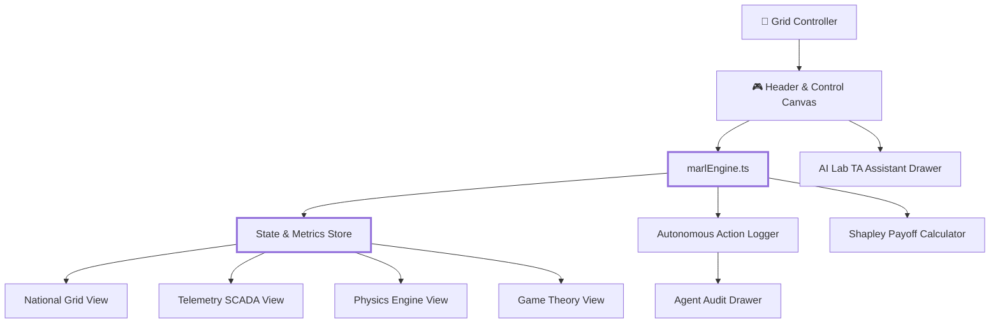

Here is the updated, production-ready `README.md` incorporating all event specifics, hackathon credentials (Cloudforge by ABV-IIITM Gwalior hosted on Unstop), developer attribution, and copyright details while strictly excluding personal phone numbers:

```markdown
<div align="center">

# ⚡ URJA-RTA: Real-Time Autonomous Grid Management System

### **Cloudforge Hackathon Entry — ABV-IIITM Gwalior**

<p>
  
  
  
  
  
  
</p>

<p>
  <b>An interactive, high-frequency autonomous power grid control dashboard</b><br/>
  featuring real-time MARL state transitions, physics-based load shedding,<br/>
  SCADA IEC 61850 telemetry emulation, and interactive game-theoretic simulation.
</p>

<br/>

**Next.js 14 · TypeScript · MARL Physics Engine · SCADA Telemetry · Game Theory · Cloud Engineering**

</div>

---

## 🧭 Navigation

<table>
<tr>
<td align="center">🚀<br/><a href="#-quick-start">Quick Start</a></td>
<td align="center">🏆<br/><a href="#-hackathon--event-context">Hackathon Context</a></td>
<td align="center">🏗️<br/><a href="#%EF%B8%8F-system-architecture">Architecture</a></td>
<td align="center">🎮<br/><a href="#-interactive-demo">Demo</a></td>
<td align="center">🧠<br/><a href="#-marl--physics-engine">MARL Engine</a></td>
<td align="center">📂<br/><a href="#-repository-structure">Structure</a></td>
<td align="center">📜<br/><a href="#-copyright--license">Copyright & License</a></td>
</tr>
</table>

<p align="center">
  <b>Developed by Shreyas Mishra</b> · Graphic Era Hill University (GEHU), Dehradun Campus<br/>
  <i>Email: shreyasmishra001@gmail.com</i>
</p>

---

## 🏆 Hackathon & Event Context

This project was engineered as part of **Cloudforge**, organized by **Atal Bihari Vajpayee - Indian Institute of Information Technology and Management (ABV-IIITM), Gwalior**, and hosted on **Unstop**.

```text
Event          : Cloudforge Hackathon
Organizer      : Atal Bihari Vajpayee - IIITM Gwalior
Platform       : Unstop (Student Builder Group)
Track          : Cloud Engineering / Cloud Computing
Developer      : Shreyas Mishra (Graphic Era Hill University, Dehradun)

```

---

## 🎯 Project Overview

**URJA-RTA** is a Next.js 14 and TypeScript application designed to emulate an **Autonomous Real-Time Power Grid Management System**. Powered by Multi-Agent Reinforcement Learning (MARL) physics loops and high-frequency SCADA telemetry interfaces, the system models real-time grid stabilization under severe stress conditions.

The system models the end-to-end grid lifecycle:

```text
Telemetry Signal Ingestion (IEC 61850 / DNP3)
      ↓
AC Phasor & Frequency Drift Calculation
      ↓
Stress Vector Detection (Peak Load / Line Trip / Cyber Attack)
      ↓
MARL Multi-Agent Coalition Assessment
      ↓
Shapley Game-Theoretic Load Balancing
      ↓
Autonomous Mitigation (Load Shedding / Isolate Node)
      ↓
SCADA Action Audit Log & Telemetry Synchronization

```

It dynamically reacts to edge-case stress conditions:

* ❌ Frequency deviation & AC phase angle drift
* ❌ High-demand grid overloads
* ❌ Simulated Cyber-Attacks on substation RTUs
* 🔄 Autonomous line isolation & transaction rollbacks
* ↩️ Real-time manual grid overrides
* ♻️ Automatic load restoration upon stabilization

---

# 🚀 Quick Start

## 1️⃣ Clone the Repository

```bash
git clone [https://github.com/your-username/urjarta.git](https://github.com/your-username/urjarta.git)
cd urjarta

```

## 2️⃣ Install Dependencies

Ensure you have Node.js 18+ installed.

```bash
npm install

```

## 3️⃣ Run Development Server

```bash
npm run dev

```

Open [http://localhost:3000](http://localhost:3000) in your browser to inspect the application.

---

# 🎮 Interactive Demo

The application provides a high-density, dark-blue SCADA-styled interface with interactive control suites.

```text
╔══════════════════════════════════════════════════════════════════════════════╗
║ ⚡ URJA-RTA :: AUTONOMOUS GRID CONTROL ROOM           [Freq: 50.00 Hz | 230V] ║
╠══════════════════════════════════════════════════════════════════════════════╣
║ [National Grid]   [SCADA Network]   [Physics Engine]   [Game Theory]         ║
║                                                                              ║
║ Stress Mode: [ Normal ▼ ]   [MARL Audit Log (Cpu)]   [AI Lab TA (Bot)]       ║
╚══════════════════════════════════════════════════════════════════════════════╝

```

Inspect interconnecting substations visually in real-time. Nodes continuously display KV ratings, active power generation (`genKW`), and active consumption (`loadKW`).

Select stress levels from the header dropdown:

* **Normal**: Balanced generation and demand (50.00 Hz stability).
* **Peak Load**: High demand injection across capital hubs.
* **Cyber Attack**: Generation throttling and malicious load spikes.
* **Line Trip**: Loss of key generation nodes requiring emergency load shedding.

When load demands exceed capacity by > 140%, the embedded MARL engine automatically triggers load shedding and logs actions to the audit drawer:

```text
 ACT-17128911-N1 :: SHED_LOAD
Reason: Frequency deviation mitigation on Northern Substation

```

Navigate to `/math` to analyze real-time coalition payoffs and Shapley marginal contributions for cooperative grid balancing.

---

# 🏗️ System Architecture



---

# 🧠 MARL & Physics Engine

The core simulation loop runs inside `lib/marlEngine.ts`.

## Physical Equations Modeled

1. **Global Frequency Drift ($f$):**

$$f = 50.0 + \left(\frac{\sum P_{\text{gen}}}{\sum P_{\text{load}}} - 1.0\right) \times 1.5$$


2. **Voltage RMS Calculation ($V_{\text{rms}}$):**

$$V_{\text{rms}} = 230 \times \min\left(1.05, \max\left(0.85, \frac{\sum P_{\text{gen}}}{\sum P_{\text{load}}}\right)\right)$$


3. **Grid Stability Score ($S$):**

$$S = \max\left(0, \min\left(100, 100 - \vert{}50.0 - f\vert{} \times 20\right)\right)$$


---

# 📂 Repository Structure

```text
.
├── README.md
├── package.json
├── tailwind.config.js
├── postcss.config.js
├── app/
│   ├── layout.tsx             # Root layout container & theme providers
│   ├── page.tsx               # Primary National Grid visual canvas
│   ├── telemetry/page.tsx     # SCADA network & RTU protocol monitor
│   ├── physics/page.tsx       # AC phasor dynamics & voltage stability
│   └── math/page.tsx          # Shapley coalition game theory matrix
├── components/
│   ├── Header.tsx             # Top navigation bar & simulation control
│   ├── TelemetryBar.tsx       # Real-time frequency & grid metric ticker
│   ├── Canvas.tsx             # Interactive node/substation canvas
│   ├── AgentDrawer.tsx        # Audit trail drawer for MARL actions
│   └── AiLabTaDrawer.tsx      # AI Assistant chat panel
└── lib/
    ├── types.ts               # Core TypeScript definitions & interfaces
    └── marlEngine.ts          # MARL state transition & physics calculations

```

---

# 📜 Copyright & License

### Copyright Notice

© **Shreyas Mishra** and **Atal Bihari Vajpayee - Indian Institute of Information Technology and Management (ABV-IIITM), Gwalior**. All Rights Reserved. Developed specifically for the **Cloudforge** Hackathon hosted on Unstop.

### License

This project is released under the **Apache License 2.0**. See the [`LICENSE`](https://www.google.com/search?q=./LICENSE) file for details.

---

## ⚡ Built for Cloudforge Hackathon at ABV-IIITM Gwalior

**Telemetry → Physics → MARL Logic → Action → Grid Stability**

⭐ Star this repository if you find real-time autonomous grid management interesting!
